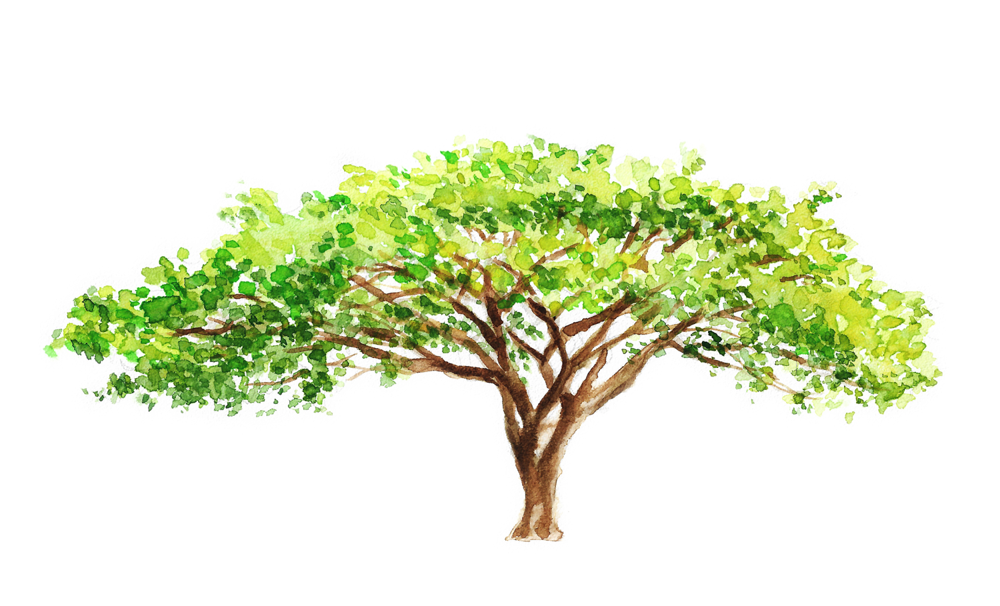
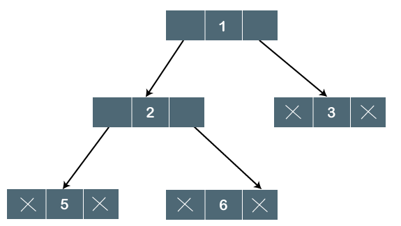

# Árvores (Trees) - Introdução

## O que é?

De modo geral ela pode ser classificada como uma estrutura de dados hierárquica que sua representação visual lembra muito uma árvore.



A semelhança ocorre quando invertemos a imagem a esquerda para que a raiz da árvore fique encima, desse modo percebemos que a raiz (Root) é a origem da árvore e cada nó dela é recebe ligações ou arestas (Links or Edges) que conectam unidirecionalmente de cima a baixo um nó a outra formando uma hierárquia onde cada nó recebe as seguintes classificações:

- **Raiz ou Root**: é o ponto de origem da árvore, na imagem acima é o **A**.
- **Node ou Nó**: são todos os pontos da árvore, ou seja, **A,B,C,D,E,F,G,H,I,J**.
- **Folha ou Leaf**: são os pontos de extremidades que não possui nenhuma ligação saindo deles para outros nós, assim no nosso exemplo são **H,I,J,F,G**.
- **Irmãos ou Siblings**: são nós que possuem ligação de entrada do mesmo nó, por exemplo, **F e G** são por receber ligações de **C**.
- **Nó pai ou Parent Node**: é o nó que aponta uma ligação para um outro nó, ou seja, **D** é um nó pai de **H e I**.
- **Nó filho ou Child Node**: é o nó que recebem uma ligação de um outro nó, ou seja, **H e I** são nós filhos de **D**.
- **Descendente ou Descendent**: é quando um nó está abaixo hierárquicamente de outro e eles possuem algum caminho de ligação, desse modo o **D** é descendente de **A**.
- **Ancestral**: é quando um nós está hierárquicamente acima de outro e eles possuem um caminho de ligação, assim o **A** é ancestral de **D**.

## Subárvore - No que isso implica?

Essa estrutura de dados possui uma particularidade interessante, ela é uma estrutura recursiva, ou seja uma árvore pode ter diversos conjuntos de subárvores que possibilitará o desenvolvimento de algoritmos de interação dentro delas bem particulares, discutiremos isso melhor a frente. Desse modo, podemos ver na nossa imagem da seção anterior que os nós **D,H,I** forma uma subárvore.

## A ideia de profundidade(Depth) e altura(Height)

Esses conceitos serão usado nos algoritmos para ilustrar interações dentro de árvores, só se preocupe por enquanto em gravar tais conceitos.

- **Profundidade - Depth**: é a quantidade de **arestas** entre um **nó e a raiz**, por exemplo a profundidade de **C** é **1** e a de **B** seria **1**.

- **Altura - height**: é a quantidade de **arestas** entre uma **folha e um nó**, por exemplo a altura de **C** é **1** e a de **B** seria **2**.

## Árvore Binária (Binary tree)

Na maior parte do tempo estaremos especificando algoritmos e criações de estruturas que contém **nós com no máximo dois filhos**, ou seja, a primeira imagem apresentada é uma árvore binária. Desse modo, ao longo dos ensinamentos apresentados aqui abordaremos muito este tipo de árvores da mesma maneira que é abordada em outras literaturas, pois elas apresentam a possibilidade da criação de algoritmos de ordenação e classificação que dependendo do caso ela será muito mais eficientes que estruturas lineares(filas, pilhas, listas, etc.).

## Implementação

A representação geral não foge da ideia de que cada nó pode ter um dado de qualquer tipo, e possui ponteiros ou referências para os _n_ próximos nós.



Em código o nó poderia ser implementado da seguinte maneira:

```dart
class Node<T> {
  final T data;
  final Node<T>? leftNode;
  final Node<T>? rightNode;

  const Node({
    required this.data,
    required this.leftNode,
    required this.rightNode,
  });
}
```

### Obrigado 😊

O texto foi um breve resumo escrito de mim para mim mesmo, mas se estiver ajudando alguém eu fico muito feliz com sua audiência, abaixo deixarei as referências para seguir felizmente com seus estudos e espero não abandonar estes resumo somente na introdução.

## Referências

[Data structures: Introduction to Trees (Youtube)](https://www.youtube.com/watch?v=qH6yxkw0u78&list=PL2_aWCzGMAwI3W_JlcBbtYTwiQSsOTa6P&index=28&ab_channel=mycodeschool)
[Tree data structure (Website)](https://www.tutorialspoint.com/data_structures_algorithms/tree_data_structure.htm)
